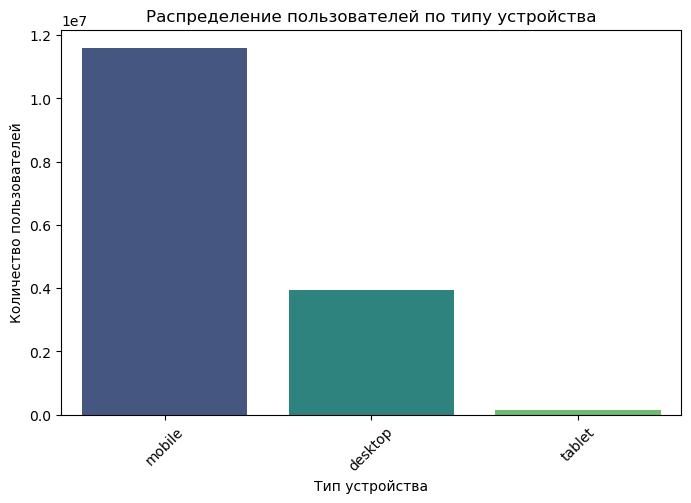
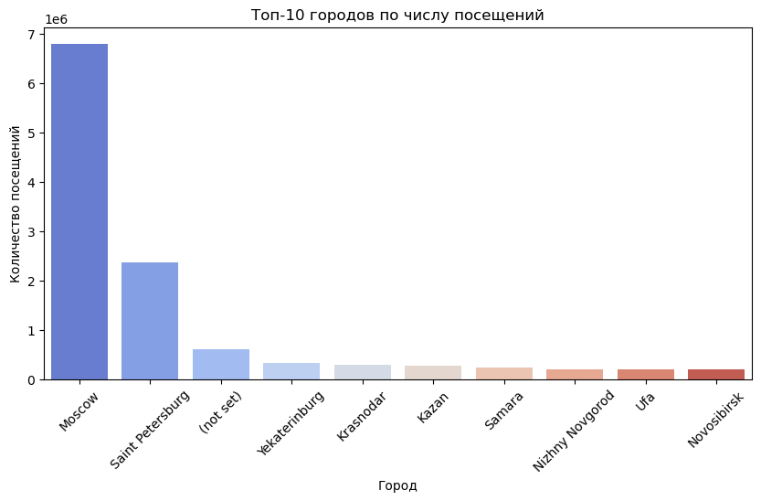
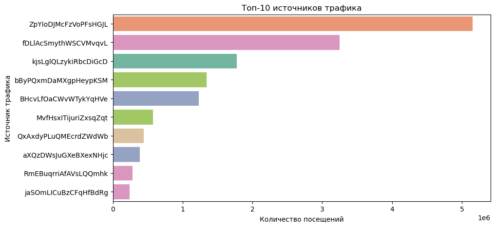
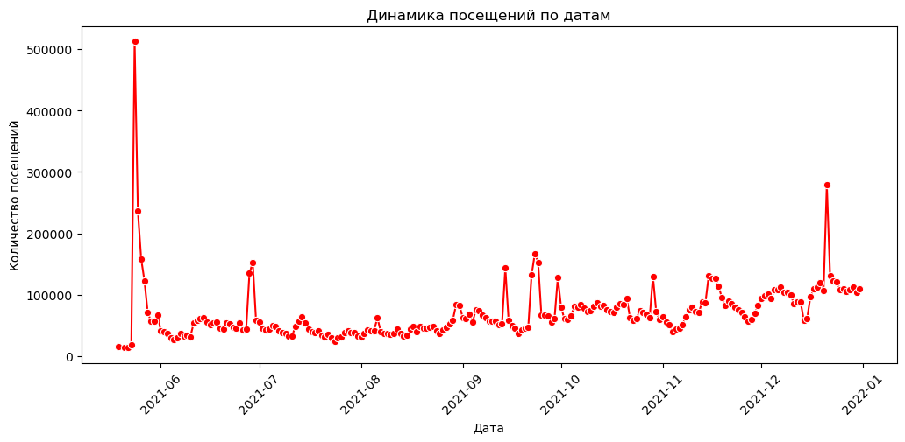
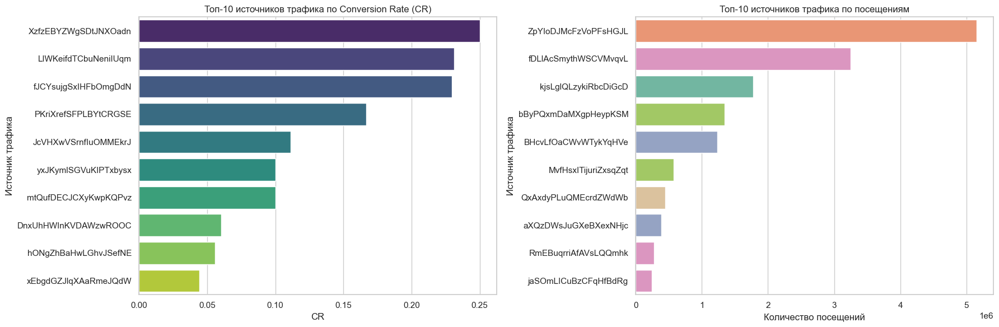
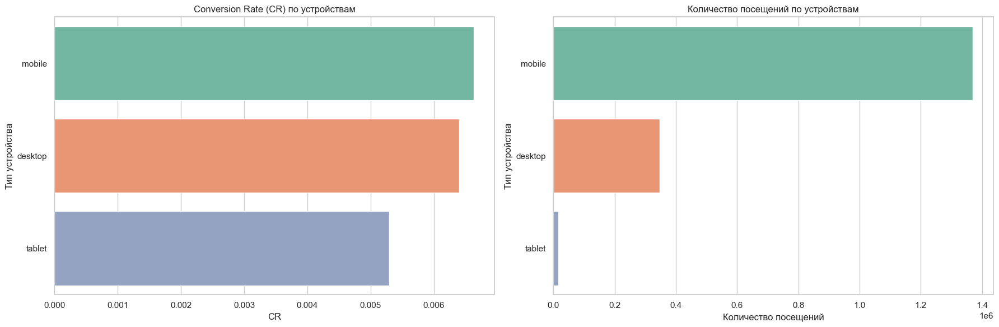
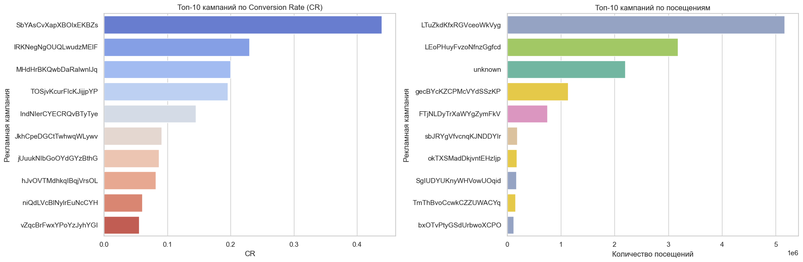
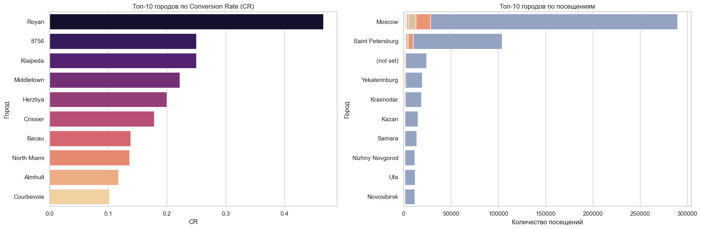
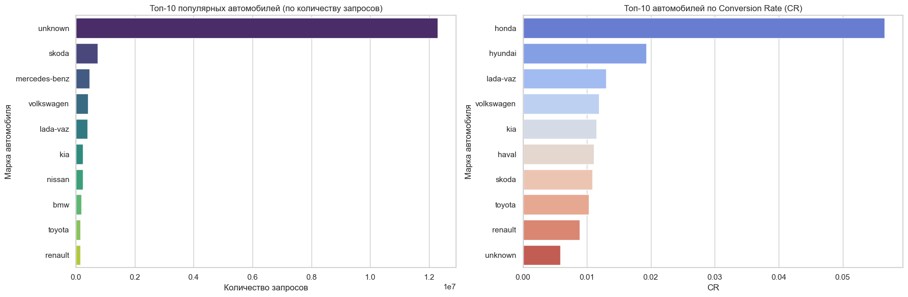

# 📊 Анализ трафика и конверсий (Google Analytics)

Этот проект выполнен в рамках финальной работы и посвящён **анализу пользовательских сессий** в Google Analytics для сервиса *«СберАвтоподписка»*.  

## 🎯 Задача  
Изучить предоставленные данные и:  
- провести **разведочный анализ (EDA)**;  
- проверить гипотезы по конверсии (CR);  
- ответить на ключевые вопросы продуктовой команды;  
- сформулировать рекомендации для бизнеса.  

---

## 🔎 Проверка гипотез  

1. **Органический vs платный трафик**  
   - CR органического трафика **существенно отличается** от платного (p-value ≈ 0).  
   - Органика конвертируется лучше → стоит пересмотреть стратегию вложений в рекламу.  

2. **Мобильные vs десктоп**  
   - Десктоп имеет **значимо более высокий CR** (≈ 0.033 против 0.028 на мобильных).  
   - Необходимо работать над улучшением мобильной версии и повышением конверсии.  

3. **Москва+СПб vs регионы**  
   - CR в столицах и в регионах **различается статистически значимо** (p-value ≪ 0.05).  
   - Есть смысл перераспределять рекламный бюджет, усиливая регионы с высоким CR.  

---

## 💡 Ответы на вопросы продуктовой команды  

- **Источники и кампании.** Топ-по CR и Топ-по объёму не совпадают. Некоторые каналы с небольшим трафиком показывают лучшую конверсию.  
- **Устройства.** Десктоп конвертится лучше, но мобильные дают больше трафика.  
- **Города.** Москва и Санкт-Петербург лидируют по трафику, но в регионах есть точки роста за счёт высокого CR.  
- **Автомобили.** Наибольший спрос на автомобили **Skoda**; по CR лидируют **Honda** и **Hyundai**.  
- **Соцсети.** Несмотря на меньший объём трафика, **CR в соцсетях выше**, поэтому есть смысл увеличить бюджет на рекламу в социальных сетях.  

---

## 📈 Визуализации  

  
*Распределение пользователей по типу устройства*  

  
*Топ-10 городов по числу посещений*  

  
*Топ-10 источников трафика*  

  
*Динамика посещений по датам*  

  
*Топ-10 источников: CR vs объём*  

  
*CR и объём по устройствам*  

  
*Топ-10 кампаний: CR vs объём*  

  
*Топ-10 городов: CR vs объём*  

  
*Популярность и CR автомобилей*  

---

## ✅ Итоговые рекомендации  

- Усилить рекламу в **соцсетях** — высокий CR при небольшом объёме.  
- Сфокусироваться на **улучшении мобильной конверсии**.  
- Пересмотреть стратегию **платного трафика**, так как органика конвертируется лучше.  
- Увеличить присутствие **Skoda** в автопарке и протестировать модели **Honda** и **Hyundai**.  
- Развивать регионы с высоким CR, а не только столичные города.  

---

📌 Этот проект демонстрирует навыки:  
- работы с **Python (pandas, matplotlib, seaborn, scipy)**;  
- проведения **статистических тестов** (Shapiro, D’Agostino, Mann–Whitney U);  
- визуализации данных;  
- формулирования **бизнес-рекомендаций** на основе анализа.  

---

👉 В репозитории вы найдёте ноутбук `финал.ipynb` и сохранённые графики.  
