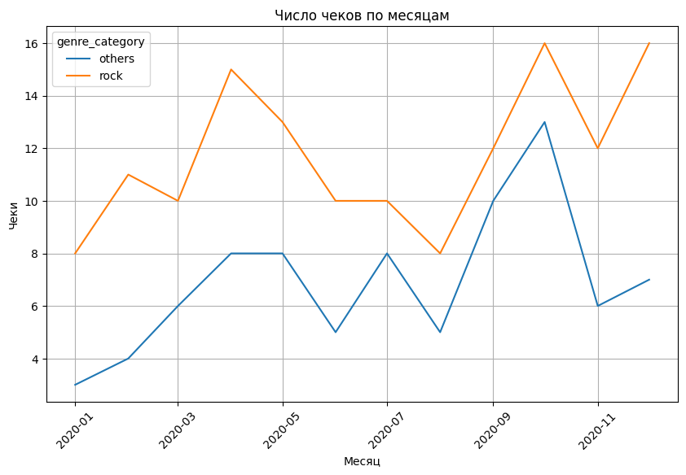
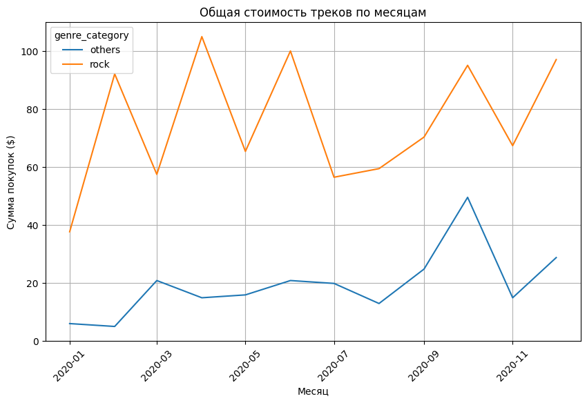

# 🧪 Project 4: Сезонность покупок треков (жанры rock vs others)

## 📌 Задача
Проверить, есть ли **сезонность** в покупках треков разных жанров по данным базы `chinook.db`.

---

## 🔎 Этапы работы
1. **Импорт данных**
   - Подключение к базе `chinook.db` через `sqlite3`.
   - SQL-запрос с джойнами таблиц `invoice`, `invoice_line`, `track`, `genre`, `media_type`.

2. **Фильтрация данных**
   - В выборку вошли только аудиофайлы (`MPEG audio file`, `AAC audio file`, `Protected AAC audio file`, `Purchased AAC audio file`).
   - Данные ограничены **2020 годом**.
   - Жанры сгруппированы:
     - `rock` = {Rock, Alternative & Punk, Metal, Alternative, Heavy Metal}
     - `others` = все остальные жанры.

3. **Формирование датафрейма**
   - Загрузка данных через `pd.read_sql_query`.
   - Проверка пропусков и дубликатов (критичных проблем не выявлено).
   - Приведение даты к первому числу месяца (`2020-01-01`, `2020-02-01`, …).

4. **Агрегация и визуализация (seaborn/matplotlib)**
   Построены помесячные графики по категориям жанров (`rock` и `others`):
   - 📈 количество купленных треков,
   - 🧾 число чеков,
   - 👥 число покупателей,
   - 💰 общая стоимость треков.

---

## 📊 Выводы
- Жанры категории **rock** показывают стабильный спрос в течение года.
- В категории **others** есть отдельные всплески (например, в праздничные периоды).
- Чёткой сезонности не выявлено, но январь и декабрь демонстрируют **рост всех показателей**.

---

## 🗂️ Состав папки
- `project4_notebook.ipynb` — Jupyter Notebook с кодом анализа и визуализациями
- `README.md` — описание проекта и выводы

---

## 📈 Визуализации

Примеры графиков анализа (сохранены в папке `figures/`):

  
*Количество купленных треков по месяцам (rock vs others)*  

  
*Число чеков по месяцам (rock vs others)*  

  
*Число покупателей по месяцам (rock vs others)*  

  
*Общая стоимость треков по месяцам (rock vs others)*  
