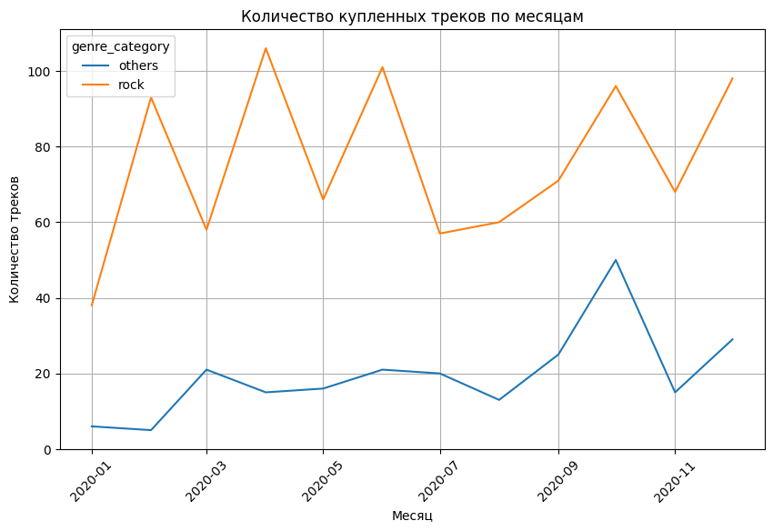
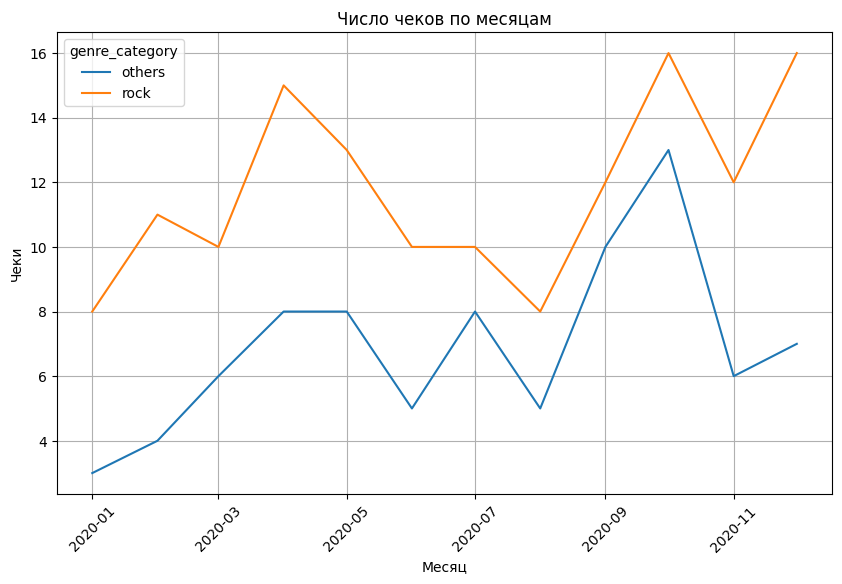
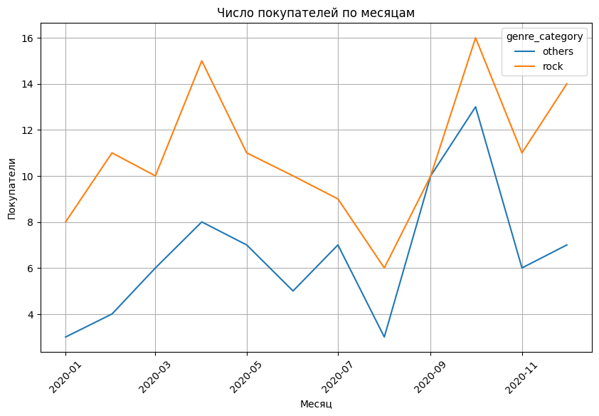

# 🧪 Анализ влияния сезонности на покупок треков (жанры rock vs others)

## 📌 Описание
Проект выполнен в **Google Colab**.  
Цель работы — проверить, есть ли **сезонность** в покупках музыкальных треков разных жанров.

---

## 🔎 Этапы работы
1. **Подготовка данных**
   - Загрузка файла  в Colab.
   - Подключение к базе через `sqlite3`.
   - SQL-запрос с несколькими JOIN-ами:
     - данные о чеках (invoice_id, дата),
     - id покупателя,
     - id треков и их жанр,
     - цена трека,
     - фильтрация по media_type (только аудио) и по 2020 году.
   - Жанры сгруппированы:
     - `rock` = {Rock, Alternative & Punk, Metal, Alternative, Heavy Metal},
     - `others` = все остальные жанры.

2. **Обработка данных**
   - Чтение результата запроса в pandas через `read_sql_query`.
   - Проверка на пропуски и дубликаты (существенных проблем не выявлено).
   - Приведение даты к первому числу месяца (`2020-01-01`, `2020-02-01`, ...).

3. **Агрегация и визуализация**
   С помощью `seaborn` и `matplotlib` построены ежемесячные графики по категориям `rock` и `others`:
   - 📈 количество купленных треков,
   - 🧾 число чеков,
   - 👥 число покупателей,
   - 💰 общая стоимость треков.

---

## 📊 Выводы
- Жанры категории **rock** показывают стабильный спрос в течение 2020 года.  
- В категории **others** видны всплески спроса (например, в праздничные периоды).  
- Явной выраженной сезонности нет, но январь и декабрь выделяются ростом всех показателей.  

---

## 📈 Визуализации
Примеры графиков анализа (сохранены в папке [figures](./figures)):

  
*Количество купленных треков по месяцам (rock vs others)*  

  
*Число чеков по месяцам (rock vs others)*  

  
*Число покупателей по месяцам (rock vs others)*  

  
*Общая стоимость треков по месяцам (rock vs others)*  

---

## 🗂️ Состав проекта
- `Анализ влияния сезонности на покупку.ipynb` — Jupyter Notebook с кодом анализа и визуализациями.  
- `figures/` — графики с результатами анализа.  
- `README.md` — описание проекта и выводы.
- Код изначально написан и выполнен в [Google Colab](https://colab.research.google.com/drive/14fs6-H4Mnvc60NtirpDwUmzu65lDG1t0?usp=sharing/).  
